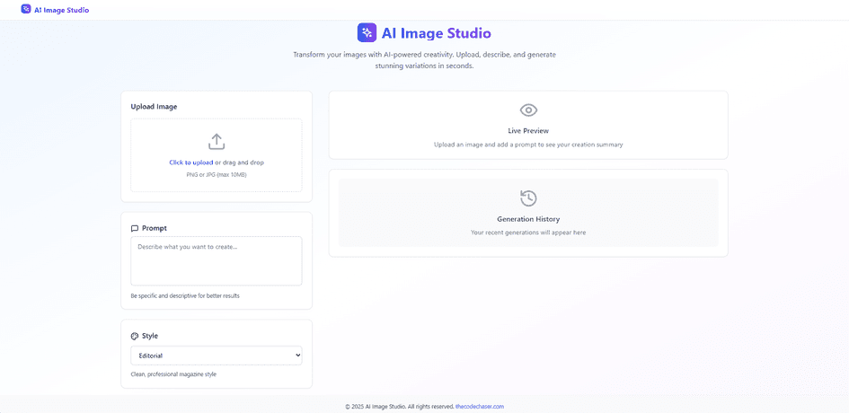
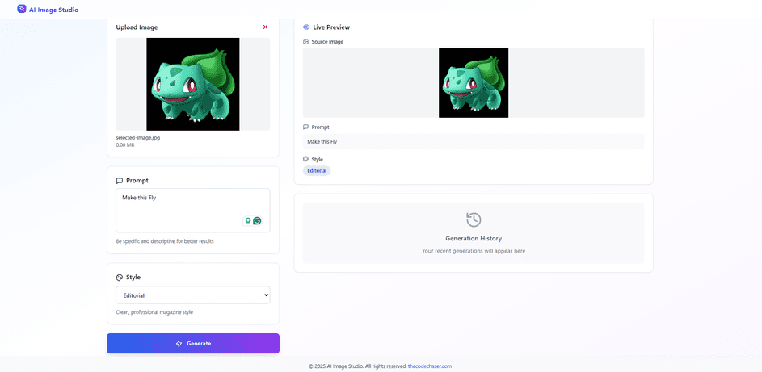
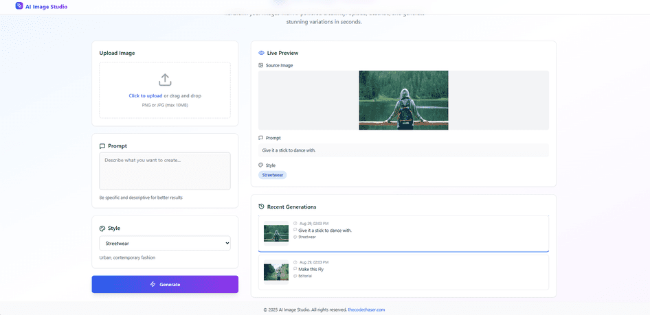

# AI Image Studio

> AI Image Studio is a lightweight React app for rapid image-ideation. Upload a PNG/JPG (auto-downscaled if large), enter a prompt, choose a style, and see a live summary before generating. A mocked API simulates latency, errors, retries with backoff, and aborts, while the last five results persist as a clickable history. Built with TypeScript and Tailwind, it’s fast, accessible, and keyboard-friendly—perfect for testing AI-studio flows without backend complexity.

## Preview:







## Built With

- HTML
- CSS
- JavaScript
- TypeScript
- REACT
- Vite
- Tailwind CSS

## Design Notes

- **Layout:** The UI is split into two main sections:  
  - Left side: Upload image, enter prompt, and choose style.  
  - Right side: Live preview with recent generations history.  
  This provides a clear workflow from input → preview → history.  

- **Styling:** TailwindCSS is used for a clean, modern interface with responsive spacing, typography, and visible focus states for accessibility.  

- **Accessibility:** All interactive elements (upload, dropdown, buttons) are keyboard navigable with ARIA labels where appropriate.  

- **Image Handling:** Client-side downscaling ensures uploaded images ≤1920px before sending, keeping performance smooth.  

- **Error Handling:** The mocked API introduces simulated latency and errors. Automatic retries with exponential backoff are implemented, along with an **Abort** option for in-flight requests.  

- **History:** The last 5 generations are stored in `localStorage` and displayed with timestamp, prompt, and style. Clicking restores them in the preview.  

- **Performance Optimizations:** Memoization is used in components where needed, and assets are split to keep bundle size lean.  

---

## Live version

[AI Image Studio](https://ai-image.thecodechaser.com)

## Getting Started

To get a local copy up and running follow these simple example steps.

### Prerequisites
- A text editor(preferably Visual Studio Code)
- Node
- Web browser

### Install
- [Git](https://git-scm.com/downloads)
- [Node](https://nodejs.org/en/download/)

### Using it Locally

- Clone the project

```bash 
git clone git@github.com:thecodechaser/ai-image-studio.git

cd ai-image-studio
```

- Install dependencies

```bash
npm i 
or
npm install
```
- To Start the development server
```bash
npm run dev
```

- To test the project
```bash
npm run test
```


## Visit And Open Files

[Visit Repo](https://github.com/thecodechaser/ai-image-studio)

## Download Repo

[Download Repo](https://github.com/thecodechaser/ai-image-studio/archive/refs/heads/main.zip)

## Authors

👤 **Ranjeet Singh**

- Website: [thecodechaser.com](https://thecodechaser.com)
- GitHub: [@thecodechaser](https://github.com/thecodechaser)
- Twitter: [@thecodechaser](https://twitter.com/thecodechaser)
- LinkedIn: [thecodechaser](https://linkedin.com/in/thecodechaser)

## 🤝 Contributing

Contributions, issues, and feature requests are welcome!

Feel free to check the [issues page](https://github.com/thecodechaser/ai-image-studio/issues).

## Show your support

Give a ⭐️ if you like this project!

## Acknowledgments

- Inspiration: Modelia

## 📝 License

This project is [MIT](./LICENSE) licensed.
